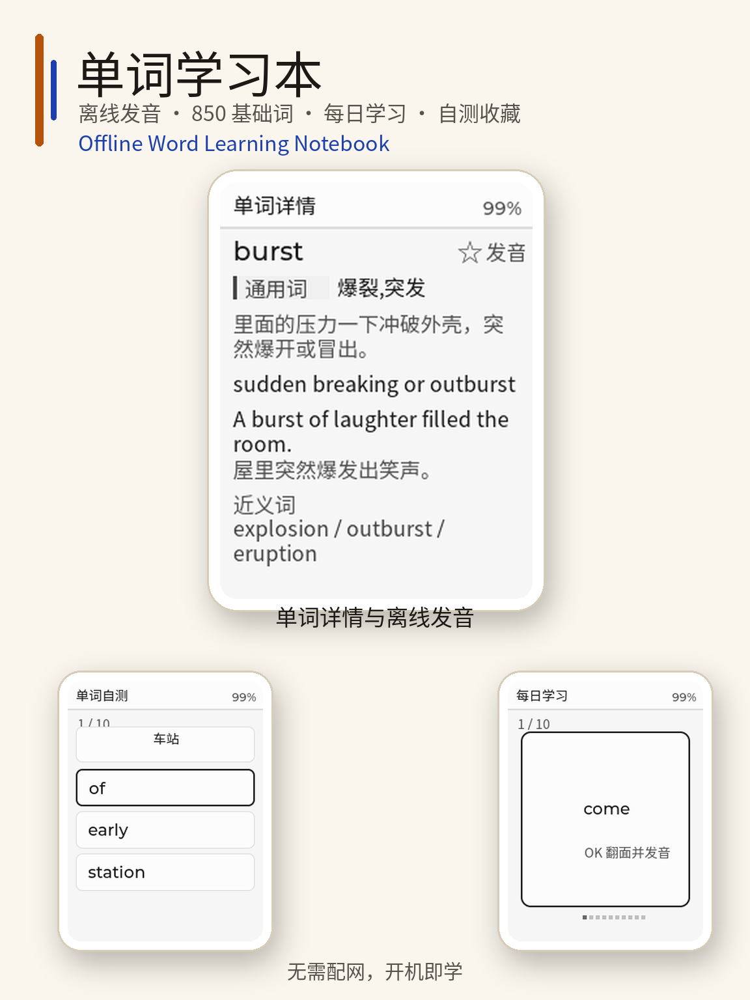

<p align="right"><a href="README.zh_CN.md">简体中文</a> | <strong>English</strong></p>

# Word Learning Notebook



Word Learning Notebook turns FoloToy AI Passport into an offline English study
device. It ships with 850 Ogden Basic English words, Chinese and English
definitions, examples, synonyms, offline pronunciation, daily study cards,
three-choice quizzes, a saved-word collection, and simple progress statistics.

The firmware starts directly in the notebook. No network setup or companion
device is required.

## Features

- Browse all 850 words or six category groups.
- Read Chinese meaning, English definition, core idea, example, translation,
  and synonyms.
- Play offline pronunciation for every word.
- Study ten words in a daily session and reveal each card with `OK`.
- Take a ten-question quiz with three answer choices.
- Save difficult words to the collection and keep learning progress in NVS.
- Review mastered, learning, saved-word, session, and quiz statistics.

## Controls

| Screen | UP / DOWN | OK | Long press OK |
| --- | --- | --- | --- |
| Home | Move selection | Open | - |
| Lists | Move selection | Open details | Back |
| Word details | Previous / next word | Play pronunciation | Back |
| Daily study | Previous / next word | Flip card / replay audio | Back |
| Quiz | Select an answer | Confirm / next question | Back |
| Collection | Move selection | Open details | Back |

In word details, double-press `OK` to add or remove the current word from the
collection.

## Build

Requirements:

- ESP-IDF 5.5.3
- Python 3.10+
- Node.js only when regenerating the LVGL fonts

Run the repository checks and build the merged image:

```bash
./tools/validate.sh --static
./tools/validate.sh --firmware
```

The merged firmware is written to:

```text
build/FoloToy-AI-Passport-full.bin
```

Flash the merged image at `0x0`.

## Project Layout

- `main/` contains the notebook UI, learning state, quiz model, NVS storage,
  audio index, and offline player.
- `components/bsp/` provides the board support layer.
- `assets/data/ogden-850.json` contains the word data.
- `assets/audio/ogden_words.adpcm` contains offline word pronunciation.
- `assets/fonts/` contains the generated 16 px and 20 px LVGL fonts.
- `docs/development/projects/word-learning-notebook.md` documents the project
  behavior and implementation.

## Regenerating Assets

```bash
python tools/build_word_data.py
python tools/build_word_audio.py
python tools/build_fonts.py
```

Always rerun the host tests after changing word data, audio assets, or fonts.

## License

See [LICENSE](LICENSE).
